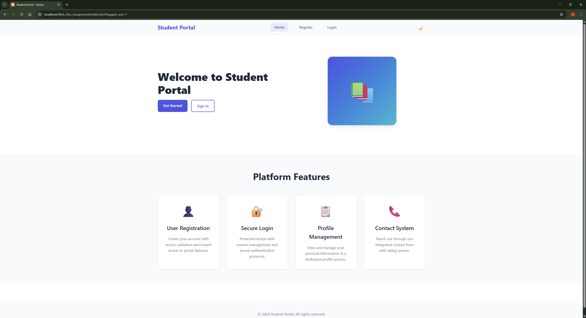
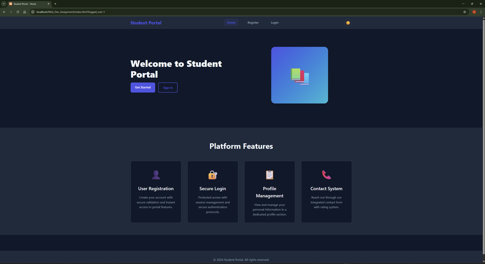
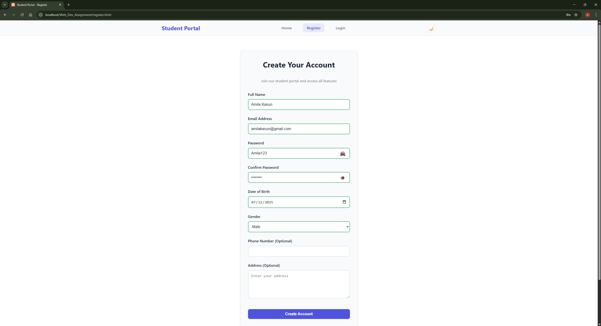
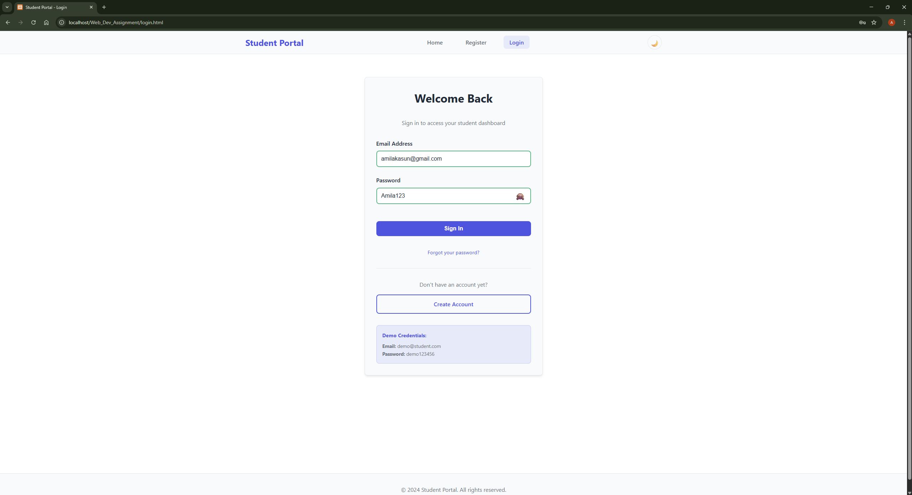
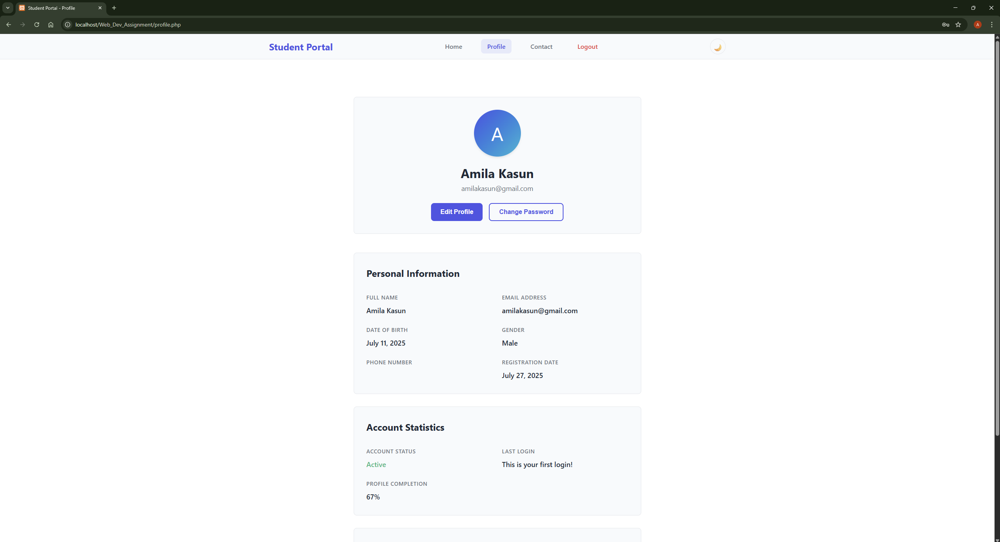
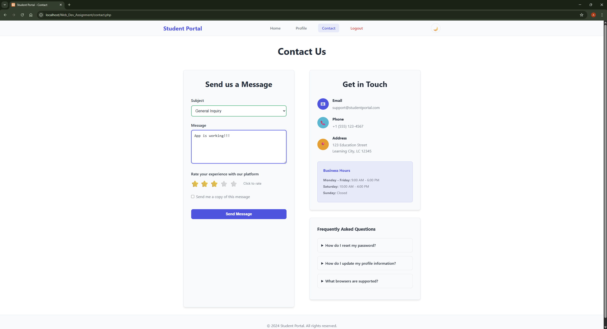
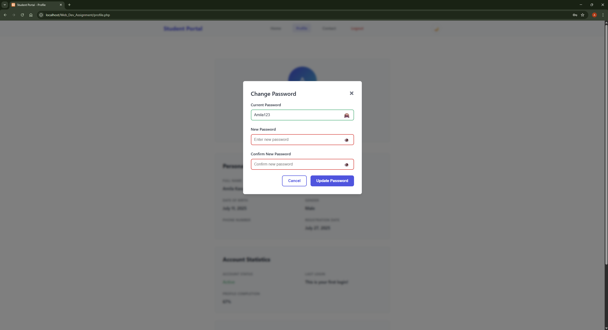

# Student Portal Web Application

A simple full-stack web application where users can register, log in, view their profile, and submit a contact form. This project integrates front-end and back-end technologies to create a functional student portal.

---

## 🚀 Project Overview

Main Features:
- User registration with email validation and duplicate checking
- Secure login and logout using PHP sessions
- Profile page showing user information, profile completion percentage, and last login time
- Contact page with message field and star rating system (accessible only after login)
- Password change functionality
- Data stored in `users.txt` and `contact.txt` as JSON using `LOCK_EX` to avoid file corruption

Technologies Used:
- **Front-end**: HTML, CSS, JavaScript  
- **Back-end**: PHP

---

## 📁 Folder Structure

```plaintext
WebApp/
├── css/
│   └── style.css
├── js/
│   └── script.js
├── php/
│   ├── register.php
│   ├── login.php
│   ├── logout.php
│   ├── contact_submit.php
│   └── change_password.php
├── data/
│   ├── users.txt
│   ├── contact.txt
│   └── email_log.txt
├── index.html
├── register.html
├── login.html
├── profile.php
└── contact.php
```

---

## 📄 Page Descriptions

- **Home Page (`index.html`)** – Introduction to the site with navigation  
- **Registration Page (`register.html`)** – Form for new users to sign up  
- **Login Page (`login.html`)** – Login form for existing users  
- **Profile Page (`profile.php`)** – Displays user data and additional stats  
- **Contact Page (`contact.php`)** – Message form with star rating, accessible after login  

---

## 💡 JavaScript Features

- **Form Validation** – Validates empty fields, email format, and password strength  
- **Password Toggle** – Show/hide password fields on click  
- **Alert/Modal Messages** – Feedback messages for success/failure events  
- **Theme Toggle** – Light/Dark mode with `localStorage` support  
- **Star Rating System** – Clickable rating feature on the contact page  
- **AJAX Form Submissions** – All forms use `fetch()` with `FormData` for async submission  

---

## 🛠️ PHP Backend Logic

- **register.php** – Validates form, checks for duplicates, hashes password, saves JSON  
- **login.php** – Verifies credentials, initiates session  
- **logout.php** – Clears and destroys session  
- **contact_submit.php** – Saves contact form data and star rating  
- **change_password.php** – Password update with hash and validation  

---

## ⚙️ Challenges and Improvements

### Challenges:
- Safe concurrent file access using `LOCK_EX`
- AJAX integration with PHP required debugging due to async issues

### Improvements:
- Fully responsive design with Flexbox and CSS Grid  
- AJAX-based form submissions for all user interactions  
- Demo account added for instant testing  
- Profile page enhancements: completion progress and last login time  

---

## 💻 How to Run the Project

### Requirements
- Local PHP server (e.g., XAMPP or WAMP)

### Steps
1. Install XAMPP  
2. Copy the project folder to `C:/xampp/htdocs/`  
3. Start Apache via XAMPP Control Panel  
4. Open your browser and go to:  
   `http://localhost/[project-folder-name]/`

### Demo Credentials
- **Email**: `demo@student.com`  
- **Password**: `demo123456`

---

## 🖼️ Screenshots

  
  
  
  
  
  
  

---
